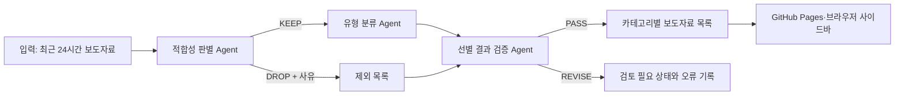

# 교육동향 보도자료 선별 AI Agent 하네스

교육부와 16개 시도교육청 본청 보도자료를 매일 수집하고, Gemini가 교육행정 담당자에게 의미 있는 교육동향만 선별·분류하는 AI Agent 하네스입니다. 최근 자료는 Chrome·Edge 사이드바에서 확인하고, 14일 이내의 이전 자료는 기간을 지정해 조회할 수 있습니다.

## 하네스 주제와 목적

교육청 보도자료에는 광역 정책 변화뿐 아니라 개별 학교 행사, 기관 방문, 수상 소식처럼 교육동향으로 보기 어려운 자료도 섞여 있습니다. 이 프로젝트는 긴 종합 보고서를 만드는 대신 업무에 참고할 보도자료를 골라 유형별 목록으로 제공하는 데 집중합니다.

수집기는 게시글 본문 영역만 추출하고, 실제 보도자료가 첨부파일에만 있는 경우 HWP·HWPX·PDF·DOCX 문서에서 본문을 읽습니다. 메뉴·첨부 안내 같은 페이지 문구와 제목 중복을 제거한 뒤 HTML 본문과 첨부 본문 중 품질이 더 높은 내용을 사용합니다.

- 주제: 전국 교육청 보도자료 기반 일일 교육동향 선별
- 목적: 반복적인 보도자료 확인을 줄이고 정책·제도·사업 변화를 빠르게 찾기
- AI: Gemini API `gemini-3.1-flash-lite`
- 원칙: 원문과 AI 판정을 분리하고 모든 판정에 원문 `newsId` 연결
- 자동화: GitHub Actions가 수집부터 AI 선별, 검증, Pages 배포까지 실행

## 전체 구조



## 에이전트 역할

1. **적합성 판별 Agent**: 각 보도자료를 `KEEP` 또는 `DROP`으로 판정합니다. 특정 교육지원청이 작성 주체로 드러나는 자료는 LLM 판단 전에 규칙으로 모두 제외합니다. 본청 정책, 여러 학교에 적용되는 사업, 광역적 파급력이 있는 변화는 남기고 개별 직속기관·학교의 일회성 행사·방문·수상과 개인의 인사발령·정기인사 명단 등은 제외합니다. 인사제도나 인사정책 자체의 변경은 선별 대상입니다.
2. **유형 분류 Agent**: `KEEP` 자료만 정책·행정, 교육과정·수업, 디지털·AI, 학생지원·복지, 교원·인사, 안전·시설, 진로·직업교육, 지역협력·행사, 기타로 분류하고 중요도를 1~5점으로 평가합니다.
3. **선별 결과 검증 Agent**: 모든 후보가 판정됐는지, `KEEP` 자료만 분류됐는지, 교육지원청 자료가 최종 목록에 남지 않았는지, 중요도가 1~5 사이 정수인지, 중복·누락과 잘못된 근거 ID가 없는지 검사합니다.

Gemini 응답은 단계별 JSON 계약으로 검사합니다. 계약을 어기면 재시도하고 계속 실패하면 규칙 기반 대체 판정을 사용합니다. 대체 처리 건수, 검증 결과, 단계별 실행 시간과 Gemini 토큰 사용량은 최종 결과에 기록됩니다.

## 입력과 출력

입력은 수집기가 만든 `public/latest.json`입니다.

```json
{
  "windowStart": "2026-07-14T08:00:00+09:00",
  "windowEnd": "2026-07-15T08:00:00+09:00",
  "items": [
    {
      "id": "policy-1",
      "source": "전북특별자치도교육청",
      "title": "AI 기반 수업 지원 정책 전면 시행",
      "summary": "도내 전체 학교를 대상으로 지원한다.",
      "url": "https://example.com/policy-1"
    }
  ]
}
```

최종 JSON의 주요 결과는 다음과 같습니다.

```json
{
  "metadata": {
    "candidateCount": 2,
    "relevantCount": 1,
    "filteredOutCount": 1,
    "validationStatus": "PASS"
  },
  "categorySummary": [{ "category": "디지털·AI", "count": 1 }],
  "selectedItems": [
    {
      "newsId": "policy-1",
      "category": "디지털·AI",
      "importance": 5,
      "selectionReason": "전체 학교에 적용되는 정책 변화다."
    }
  ],
  "excludedItems": [
    {
      "newsId": "event-1",
      "reason": "개별 학교의 일회성 행사다."
    }
  ]
}
```

사이드바는 중요도를 `★★★★★` 형식으로 표시하며 5점부터 내림차순으로 정렬합니다. 같은 점수에서는 최신 보도자료가 먼저 표시됩니다.

최근 24시간 자료가 없는 날도 오류로 중단하지 않고 0건짜리 정상 브리핑을 발행합니다.

생성 파일:

- `public/briefings/latest.json`: 사이드바가 읽는 최신 AI 선별 결과
- `public/briefings/latest.md`: 사람이 읽을 수 있는 카테고리별 목록
- `public/briefings/YYYY-MM-DD.json`: 날짜별 구조화 결과
- `public/briefings/runs/<runId>.json`: 판별·분류·검증·실행 기록

## Gemini API 설정

GitHub 저장소의 `Settings` → `Secrets and variables` → `Actions`에 다음 Repository secret을 등록합니다.

- 이름: `GEMINI_API_KEY`
- 값: Google AI Studio에서 발급받은 API 키

API 키는 저장소 파일, 로그, 브라우저 확장 프로그램에 포함되지 않습니다. GitHub Actions 환경변수로만 전달됩니다.

## 로컬 실행

Python 3.11 이상에서 다음 명령으로 실행합니다. 로컬 PowerShell에도 `GEMINI_API_KEY` 환경변수가 있어야 합니다.

```powershell
python -m pip install -r requirements.txt
$env:GEMINI_API_KEY = "발급받은 키"
.\run_harness.ps1
```

소량으로 구조를 시험할 수 있습니다.

```powershell
.\run_harness.ps1 -MaxItems 6
python -m unittest discover -s tests -v
```

Ollama를 비상용 로컬 제공자로 실행하려면 다음처럼 지정합니다.

```powershell
.\run_harness.ps1 -Provider ollama -Model exaone3.5:7.8b
```

## 수집과 저장

GitHub Actions는 매일 한국시간 오전 8시에 실행되며, 오전 8시 기준 직전 24시간에 작성된 새 보도자료를 수집합니다. 중복 자료는 저장하지 않고 `public/news.json`에는 최근 14일 자료만 유지합니다.

`crawler/sources.json`에는 교육부와 16개 시도교육청의 본청 게시판 17개가 등록되어 있습니다.

- 전북특별자치도교육청: [`BBS_0000222`](https://news.jbe.go.kr/board/list.jbe?boardId=BBS_0000222&menuCd=DOM_000001201001000000&contentsSid=2105&cpath=)만 수집
- 전남광주통합특별시교육청: [`S1N1`](https://www.jngjedu.kr/news/articleList.html?sc_section_code=S1N1&view_type=sm)만 수집
- 두 기관의 직속기관·교육지원청·학교 게시판은 수집하지 않음
- 인천광역시교육청의 묶음 보도자료는 개별 보도자료로 분리 저장

수동 실행은 저장소의 `Actions` → `Collect education press releases` → `Run workflow`에서 시작합니다. 워크플로가 결과를 저장하려면 `Workflow permissions`가 `Read and write permissions`여야 합니다.

## 확장 프로그램

1. Chrome의 `chrome://extensions` 또는 Edge의 `edge://extensions`를 엽니다.
2. 개발자 모드를 켭니다.
3. `extension` 폴더를 압축해제된 확장 프로그램으로 불러옵니다.
4. 확장 프로그램 아이콘 또는 `Ctrl+Shift+Y`로 사이드바를 엽니다.

AI 선별 결과가 있으면 사이드바는 `KEEP` 자료만 목록의 기반으로 사용합니다. 저장된 관심 키워드가 있으면 그 목록을 먼저 관심 자료로 추리고, 검색창은 관심 자료 목록 안에서 제목과 내용을 다시 검색합니다. 관심 키워드를 모두 지우면 AI가 선별한 전체 교육동향을 검색합니다. AI 실행 결과가 없으면 최근 24시간 수집 자료를 그대로 사용하는 안전한 대체 동작을 합니다.

`이전 보도자료 기간 조회`에서는 최근 14일 자료를 날짜·기관·검색어·관심 키워드로 조회할 수 있습니다. 단축키는 `chrome://extensions/shortcuts` 또는 `edge://extensions/shortcuts`에서 바꿀 수 있습니다.

## 저장소 구성

```text
crawler/                 보도자료 수집·정제
harness/                 AI Agent와 오케스트레이터
  agents/                적합성·분류·검증 Agent
  contracts/             단계별 JSON 계약
  prompts/               Gemini 역할 프롬프트
extension/               Chrome·Edge 사이드바
public/                  GitHub Pages 데이터
tests/                   하네스 자동 테스트와 예시 입력
.github/workflows/       매일 수집·AI 선별·Pages 배포
```

프로그램의 동작, 수집 대상, 저장 정책 또는 하네스 구조가 바뀌면 이 README도 같은 변경에서 함께 갱신합니다.
