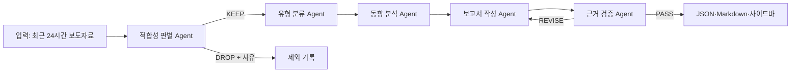

# 교육동향 보도자료 AI Agent 하네스

교육부와 16개 시도교육청 본청 보도자료를 매일 수집하고, 로컬 EXAONE이 교육행정 담당자에게 의미 있는 교육동향만 선별·분류·분석하는 AI Agent 하네스입니다. 최근 자료는 Chrome·Edge 사이드바에서 확인하고, 14일 이내의 이전 자료는 기간을 지정해 조회할 수 있습니다.

## 하네스 주제와 목적

교육청 보도자료에는 광역 정책 변화뿐 아니라 개별 학교 행사, 기관 방문, 수상 소식처럼 일일 교육동향으로 보기 어려운 자료도 섞여 있습니다. 이 프로젝트는 단순 요약기가 아니라 여러 역할의 에이전트가 순서대로 처리하고 결과를 다시 검증하는 업무 하네스를 구현합니다.

- 주제: 전국 교육청 보도자료 기반 일일 교육동향 분석
- 목적: 반복적인 보도자료 확인 업무를 줄이고 정책·제도·사업 변화를 근거와 함께 파악
- AI: 노트북의 Ollama `exaone3.5:7.8b`
- 원칙: 원문과 AI 생성 결과를 분리하고, 모든 주요 판단에 원문 `newsId`를 연결
- 비용: 외부 LLM API와 외부 DB 없이 GitHub Pages와 로컬 LLM 사용

## 전체 구조



이 구조는 후보 자료를 병렬 묶음으로 처리하는 fan-out/fan-in 패턴과, 작성 결과를 별도 리뷰어가 검사하는 producer-reviewer 패턴을 함께 사용합니다.

## 에이전트 역할

1. **적합성 판별 Agent**: EXAONE이 각 보도자료를 `KEEP` 또는 `DROP`으로 판정합니다. 본청 정책, 여러 학교에 적용되는 사업, 광역적 파급력이 있는 변화는 남기고 개별 기관의 일회성 행사·방문·수상 등은 제외합니다.
2. **유형 분류 Agent**: 남은 자료를 정책·행정, 교육과정·수업, 디지털·AI, 학생지원·복지, 교원·인사, 안전·시설, 진로·직업교육, 지역협력·행사, 기타로 분류합니다.
3. **동향 분석 Agent**: 기관과 유형을 비교해 반복되거나 파급력이 큰 흐름을 찾습니다.
4. **보고서 작성 Agent**: 업무용 종합 요약, 핵심 동향, 주요 보도자료, 계속 확인할 사항을 작성합니다.
5. **근거 검증 Agent**: 형식, 존재하지 않는 근거 ID, 근거 없는 주장과 수치를 검사합니다. 수정이 필요하면 보고서 작성 Agent에 최대 2회 되돌립니다.

각 단계는 JSON 계약을 검증합니다. 모델 응답이 계약을 어기면 재시도하고, 계속 실패하면 규칙 기반 대체 결과를 사용해 실행이 중단되지 않도록 합니다. 대체 처리 건수와 단계별 실행 시간은 최종 결과의 `metadata`와 `trace`에 남습니다.

## 입력·출력

입력은 수집기가 만든 `public/latest.json`입니다.

```json
{
  "windowStart": "2026-07-14T08:00:00+09:00",
  "windowEnd": "2026-07-15T08:00:00+09:00",
  "items": [
    {
      "id": "policy-1",
      "source": "전북특별자치도교육청",
      "title": "AI 기반 수업 지원 정책 전면 시행",
      "summary": "도내 전체 학교를 대상으로 지원한다.",
      "url": "https://example.com/policy-1"
    }
  ]
}
```

하네스 실행 후 다음 파일이 생성됩니다.

- `public/briefings/latest.json`: 사이드바가 읽는 최신 AI 분석 결과
- `public/briefings/latest.md`: 사람이 바로 읽을 수 있는 최신 보고서
- `public/briefings/YYYY-MM-DD.json`: 날짜별 구조화 결과
- `public/briefings/runs/<runId>.json`: 판별·분류·검증·실행 기록 전체

결과에는 후보 수, 채택 수, 제외 수, 제외 사유, 분류, 핵심 동향, 원문 근거, 검증 상태가 포함됩니다.

## 실행 방법

Python 3.11 이상과 Ollama가 필요합니다.

```powershell
python -m pip install -r requirements.txt
ollama pull exaone3.5:7.8b
ollama serve
```

다른 PowerShell 창에서 최근 수집 자료 전체를 분석합니다.

```powershell
.\run_harness.ps1
```

소량으로 구조를 시험하려면 다음처럼 실행합니다.

```powershell
.\run_harness.ps1 -MaxItems 6
python -m harness.run --input tests/fixtures/sample_input.json --output .tmp/harness-example
```

실제 EXAONE으로 예시 입력의 적합성 판별을 실행한 결과, 한 번의 호출에서 대체 처리 없이 다음처럼 구분했습니다.

```json
{
  "items": [
    {
      "newsId": "policy-1",
      "decision": "KEEP",
      "scope": "provincial",
      "reason": "전체 학교 대상 AI 수업 지원 정책으로 확산 가능성이 큰 변화다.",
      "confidence": 0.95
    },
    {
      "newsId": "event-1",
      "decision": "DROP",
      "scope": "local",
      "reason": "개별 학교의 단순 행사로 정책적 의미가 부족하다.",
      "confidence": 0.9
    }
  ],
  "attempts": 1,
  "fallbackCount": 0
}
```

자동 테스트는 실제 모델 없이 하네스의 단계 연결과 근거 검증을 확인합니다.

```powershell
python -m unittest discover -s tests -v
```

## 수집과 저장

GitHub Actions는 매일 한국시간 오전 8시에 실행되며, 오전 8시 기준 직전 24시간에 작성된 새 보도자료를 수집합니다. 중복 자료는 저장하지 않고 `public/news.json`에는 최근 14일 자료만 유지합니다. 예약 실행은 GitHub 사정에 따라 몇 분 늦게 시작될 수 있지만 조회 기준 시각은 오전 8시로 고정됩니다.

`crawler/sources.json`에는 교육부와 16개 시도교육청의 본청 게시판 17개가 등록되어 있습니다.

- 전북특별자치도교육청: [`BBS_0000222`](https://news.jbe.go.kr/board/list.jbe?boardId=BBS_0000222&menuCd=DOM_000001201001000000&contentsSid=2105&cpath=)만 수집
- 전남광주통합특별시교육청: [`S1N1`](https://www.jngjedu.kr/news/articleList.html?sc_section_code=S1N1&view_type=sm)만 수집
- 두 기관의 직속기관·교육지원청·학교 게시판은 수집하지 않음
- 인천광역시교육청의 묶음 보도자료는 개별 보도자료로 분리 저장

GitHub Actions와 GitHub Pages는 공개 보도자료 수집·저장·배포만 담당합니다. 로컬 EXAONE 분석은 외부 API로 원문을 보내지 않습니다. AI 결과를 GitHub Pages에서 보려면 로컬 실행으로 생성한 `public/briefings` 결과를 저장소에 반영해야 합니다.

수동 수집은 저장소의 `Actions` → `Collect education press releases` → `Run workflow`에서 실행합니다. 워크플로가 결과를 저장하려면 `Workflow permissions`가 `Read and write permissions`여야 합니다.

## 확장 프로그램

1. Chrome의 `chrome://extensions` 또는 Edge의 `edge://extensions`를 엽니다.
2. 개발자 모드를 켭니다.
3. `extension` 폴더를 압축해제된 확장 프로그램으로 불러옵니다.
4. 확장 프로그램 아이콘 또는 `Ctrl+Shift+Y`로 사이드바를 엽니다.

사이드바는 최근 24시간 자료 중 저장된 관심 키워드와 일치하는 보도자료를 보여줍니다. 검색창은 그 결과 목록 안에서 제목과 내용을 다시 검색합니다. 관심 키워드를 모두 지우면 최근 24시간 전체 자료를 대상으로 검색합니다. AI 결과가 있으면 채택·제외 건수와 핵심 교육동향도 함께 표시합니다.

`이전 보도자료 기간 조회`에서는 최근 14일 자료를 날짜·기관·검색어·관심 키워드로 조회할 수 있습니다. 단축키는 `chrome://extensions/shortcuts` 또는 `edge://extensions/shortcuts`에서 바꿀 수 있습니다.

## 저장소 구성

```text
crawler/                 보도자료 수집·정제
harness/                 AI Agent와 오케스트레이터
  agents/                적합성·분류·분석·작성·검증 Agent
  contracts/             단계별 JSON 계약
  prompts/               EXAONE 역할 프롬프트
extension/               Chrome·Edge 사이드바
public/                  GitHub Pages 데이터
tests/                   하네스 자동 테스트와 예시 입력
.github/workflows/       매일 수집·Pages 배포
```

프로그램의 동작, 수집 대상, 저장 정책 또는 하네스 구조가 바뀌면 이 README도 같은 변경에서 함께 갱신합니다.
